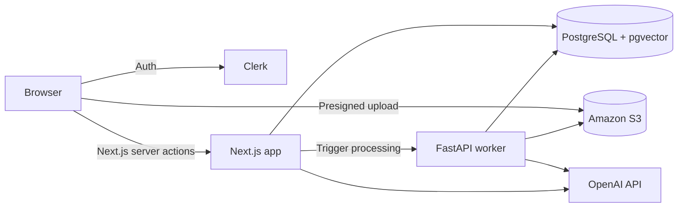

# CogniGraph

> Turn a collection of documents into an explorable knowledge graph, then ask questions grounded in those sources.

[](https://nextjs.org/) [](https://react.dev/) [](https://www.typescriptlang.org/) [](https://www.python.org/)

> **Screenshots coming soon.** Run the project locally using the setup guide below to explore the current interface.

## Why this project?

Search is useful when you know what you are looking for. CogniGraph is designed for the harder problem: understanding how ideas, people, events, and claims connect across many sources. It combines retrieval-augmented generation with a visual graph so users can inspect the context behind a conversation instead of treating AI output as a black box.

This portfolio project demonstrates a production-oriented full-stack workflow: authenticated workspaces, direct-to-S3 uploads, asynchronous Python processing, vector retrieval, domain-aware entity extraction, an interactive graph, streaming chat, and document exports.

## Highlights

- **Source ingestion** — uploads use presigned S3 URLs and are processed outside the web request lifecycle.
- **Domain-aware extraction** — legal, financial, medical, engineering, sales, regulatory, journalism, HR, and general strategies tune chunking and graph schemas.
- **Interactive exploration** — filter, search, and inspect knowledge graph nodes and their source documents.
- **Grounded conversation** — semantic retrieval supplies relevant document chunks to the chat experience.
- **Flexible workspace** — switch among graph, chat, and split views; export a document or the complete collection.
- **Responsive and accessible UI** — keyboard-visible focus states, reduced-motion support, semantic navigation, and mobile layouts.

## Architecture



The Next.js application owns the UI, authentication, uploads, retrieval, and chat. The FastAPI service downloads newly uploaded files, extracts text/OCR, creates embeddings and graph relationships, and persists results in PostgreSQL.

## Tech stack

| Area | Tools |
| --- | --- |
| Web | Next.js 16, React 19, TypeScript, Tailwind CSS 4 |
| UI | Framer Motion, Lucide, react-force-graph-2d |
| Auth | Clerk |
| Data | PostgreSQL, pgvector |
| AI | OpenAI, AI SDK |
| Storage | Amazon S3 |
| Worker | FastAPI, psycopg, pypdf |
| Operations | Upstash Redis rate limiting |

## Local setup

### Prerequisites

- Node.js 20+ and npm
- Python 3.10+
- PostgreSQL with [`pgvector`](https://github.com/pgvector/pgvector) available
- Clerk, OpenAI, and S3-compatible credentials

### 1. Install and configure the web app

```bash
git clone https://github.com/TahubCS/cognigraph.git
cd cognigraph
npm ci
cp .env.example .env.local
```

Fill in `.env.local`. The variables are grouped and documented in `.env.example`; do not commit real credentials.

### 2. Create the database schema

Create the database referenced by `DATABASE_URL`, ensure it supports the `vector` and `uuid-ossp` extensions, then run:

```bash
npm run db:setup
```

### 3. Start the processing service

In a second terminal:

```bash
cd python_service
python -m venv .venv
source .venv/bin/activate        # Windows: .venv\Scripts\activate
python -m pip install -r requirements.txt
uvicorn main:app --reload --port 8000
```

The worker loads `../.env.local` and exposes a health endpoint at `http://localhost:8000/`.

### 4. Start the web app

```bash
npm run dev
```

Open [http://localhost:3000](http://localhost:3000). Upload a supported document, wait for processing to complete, then explore its graph or open the chat view.

## Useful commands

| Command | Purpose |
| --- | --- |
| `npm run dev` | Start the Next.js development server |
| `npm run lint` | Run ESLint |
| `npm run typecheck` | Check TypeScript without emitting files |
| `npm run build` | Create a production build |
| `npm run db:setup` | Create required extensions, tables, and vector index |
| `uvicorn main:app --reload --port 8000` | Start the Python processing service from `python_service/` |

## Project structure

```text
src/
├── actions/          # Authenticated data, storage, retrieval, and export actions
├── app/              # Next.js App Router pages and API routes
├── components/       # Landing page and interactive workspace UI
├── lib/              # Database, rate-limit, color, and export utilities
└── scripts/          # Database bootstrap script
python_service/
├── main.py           # FastAPI document-processing worker
└── requirements.txt
```

## Security and limitations

- Uploaded content is sent to configured third-party storage and AI providers; review their data policies before using sensitive material.
- The domain modes improve extraction prompts but do **not** make responses professional legal, financial, or medical advice.
- This repository currently has lint, type, and build checks but no automated unit/integration test suite.
- No license is currently included, so the source is not granted an open-source license by default.

## Roadmap

- Add unit tests for chunking, exports, and graph transformations
- Add end-to-end coverage for upload → processing → chat
- Surface citations at the sentence level in generated responses
- Add graph clustering and saved queries

---

Built by [TahubCS](https://github.com/TahubCS) as a full-stack AI engineering portfolio project.
